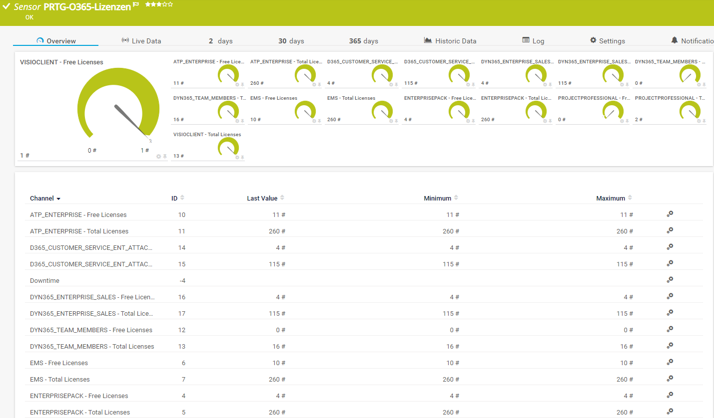

# PRTG-M365-SKU
# About

## Project Owner:

Jannos-443

## Project Details

Monitors Microsoft 365 License usage

## HOW TO

1. Place "PRTG-M365-SKU.ps1" under "C:\Program Files (x86)\PRTG Network Monitor\Custom Sensors\EXEXML"

2. Create AzureAD App
   - Open Azure AD
   - Register new APP
   - Overview >> Get Application ID 
   - Set API Permissions >> MS Graph >> Application >> Organization.Read.All
   - Certificates & secrets >> new Secret >> unlimited
or follow this Guide: [Paessler M365 Credentials](https://kb.paessler.com/en/topic/88462-how-do-i-obtain-credentials-and-set-permissions-for-the-microsoft-365-sensors)

3. Create new Sensor 
   - EXE/Script = PRTG-M365-SKU.ps1
   - Parameter = "-ApplicationID 'Test-APPID' -TenatDomainName 'contoso.onmicrosoft.com' -AccessSecret 'Test-AppSecret' -SKUPattern '(Enterprisepack|EMS|ATP_ENTERPRISE)'

## Examples

SKUPattern
------------------
You can use the **parameter $SKUPattern** and **parameter $exclude** to exclude/include specific SKUs.

For more information about the different SKUs, visit [Microsoft Docs](https://docs.microsoft.com/en-us/azure/active-directory/enterprise-users/licensing-service-plan-reference).

For more information about regular expressions in PowerShell, visit [Microsoft Docs](https://docs.microsoft.com/en-us/powershell/module/microsoft.powershell.core/about/about_regular_expressions).
