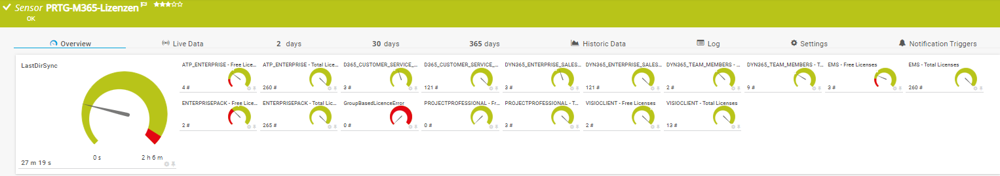
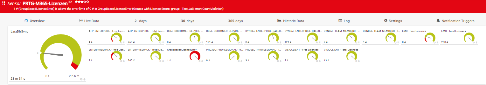

<!-- ABOUT THE PROJECT -->
### About The Project
Project Owner: Jannos-443

PRTG Powershell Script to monitor Microsoft 365 license usage

Free and open source: [MIT License](https://github.com/Jannos-443/PRTG-M365/blob/main/LICENSE)

**Features**
* Microsoft 365 License usage
* Last Azure AD Sync
* Group Based Licencing Error

## HOW TO

1. Place `PRTG-M365-Licences.ps1` under `C:\Program Files (x86)\PRTG Network Monitor\Custom Sensors\EXEXML`

2. Create AzureAD App
   - Open Azure AD
   - Register new APP
   - Overview >> Get Application ID 
   - Set API Permissions >> MS Graph >> Application >> Organization.Read.All
   - Certificates & secrets >> new Secret
or follow this Guide: [Paessler M365 Credentials](https://kb.paessler.com/en/topic/88462-how-do-i-obtain-credentials-and-set-permissions-for-the-microsoft-365-sensors)

3. Create new Sensor 
   - EXE/Script Advanced = `PRTG-M365-Licences.ps1`
   - Parameter = `-ApplicationID 'Test-APPID' -TenatDomainName 'contoso.onmicrosoft.com' -AccessSecret 'Test-AppSecret' -SKUPattern '^(Enterprisepack|EMS|ATP_ENTERPRISE)$'`

4. Set your own Channel limits if needed

## Usage

```powershell
-ApplicationID 'xxxxxxxxx-xxxx-xxxx-xxxx-xxxxxxxxxxxx' -TenatDomainName 'contoso.onmicrosoft.com' -AccessSecret 'YourSecretKey' -SKUPattern '(Enterprisepack|EMS|ATP_ENTERPRISE|VISIOCLIENT|PROJECTPROFESSIONAL|DYN365_ENTERPRISE_SALES|DYN365_TEAM_MEMBERS|D365_CUSTOMER_SERVICE_ENT_ATTACH)'
```
Full example PRTG parameters

```powershell
... -SKUPattern '^(Enterprisepack\|EMS\|ATP_ENTERPRISE)$'
```
Includes only "O365 E3" (Enterprisepack) and "EMS" (EMS)

```powershell
... -SKUPattern '^(Enterprisepack\|EMS\|ATP_ENTERPRISE)$' -exclude
```
Includes all but  "O365 E3" (Enterprisepack) and "EMS" (EMS)

```powershell
**without** -SKUPattern 
```
 displays all Lics with at least 1 License


Example Output:







SKUPattern
------------------
You can use the **parameter $SKUPattern** and **parameter $exclude** to exclude/include specific SKUs.

For more information about the different SKUs, visit [Microsoft Docs](https://docs.microsoft.com/en-us/azure/active-directory/enterprise-users/licensing-service-plan-reference).

For more information about regular expressions in PowerShell, visit [Microsoft Docs](https://docs.microsoft.com/en-us/powershell/module/microsoft.powershell.core/about/about_regular_expressions).
