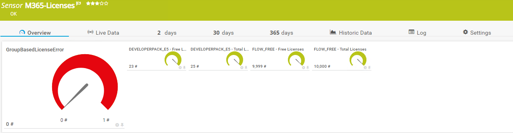
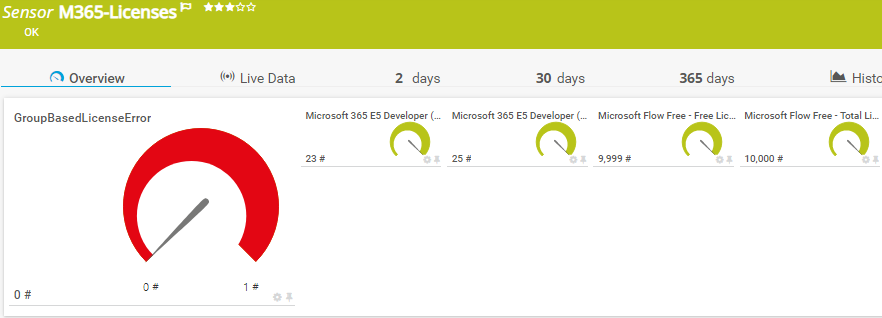
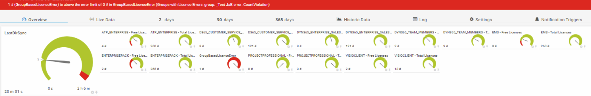

<!-- ABOUT THE PROJECT -->
### About The Project
Project Owner: Jannos-443

PRTG Powershell Script to monitor Microsoft 365 license usage

Free and open source: [MIT License](https://github.com/Jannos-443/PRTG-M365/blob/main/LICENSE)

**Features**
* Microsoft 365 License usage
* Last Azure AD Sync
* Group Based Licensing Error

## Changelog
### V1.0
- Added FriendlyName Feature
- Added Ability to use HTTP Push to avoid local Permission on critical Remote Servers (Backup etc.)

## HOW TO

1. Place `PRTG-M365-Licenses.ps1` under `C:\Program Files (x86)\PRTG Network Monitor\Custom Sensors\EXEXML`

2. Create AzureAD App
   - Open Azure AD
   - Register new APP
   - Overview >> Get Application ID
   - Set API Permissions >> MS Graph >> Application >>
     - Organization.Read.All
     - Group.Read.All
   - Certificates & secrets >> new Secret
or follow this Guide: [Paessler M365 Credentials](https://kb.paessler.com/en/topic/88462-how-do-i-obtain-credentials-and-set-permissions-for-the-microsoft-365-sensors)

3. Create new Sensor
   - EXE/Script Advanced = `PRTG-M365-Licenses.ps1`
   - Parameter = `-ApplicationID 'Test-APPID' -TenantID 'YourTenantID' -AccessSecret 'Test-AppSecret' -SKUPattern '^(Enterprisepack|EMS|ATP_ENTERPRISE)$'`

4. Set your own Channel limits if needed

## Usage
Show all Lics with at least 1 License
```powershell
-ApplicationID 'xxxxxxxxx-xxxx-xxxx-xxxx-xxxxxxxxxxxx' -TenantID 'YourTenantID' -AccessSecret 'YourSecretKey'
```

Include Enterprisepack, EMS, ATP, VISIO, PROJECT and DYNAMICS Licenses
```powershell
... -IncludeSKU '(Enterprisepack|EMS|ATP_ENTERPRISE|VISIOCLIENT|PROJECTPROFESSIONAL|DYN365_ENTERPRISE_SALES|DYN365_TEAM_MEMBERS|D365_CUSTOMER_SERVICE_ENT_ATTACH)'
```

Include only "O365 E3" (Enterprisepack) and "EMS" (EMS)
```powershell
... -IncludeSKU '^(Enterprisepack|EMS|ATP_ENTERPRISE)$'
```

Include all but "O365 E3" (Enterprisepack) and "EMS" (EMS)
```powershell
... -ExcludeSKU '^(Enterprisepack|EMS|ATP_ENTERPRISE)$' -exclude
```

Use FriendlyNames for ChannelNames
```powershell
-ApplicationID 'xxxxxxxxx-xxxx-xxxx-xxxx-xxxxxxxxxxxx' -TenantID 'YourTenantID' -AccessSecret 'YourSecretKey' -FriendlyNames
```

Include only "Office 365 E3"
```powershell
... -FriendlyNames -IncludeName '^(Office 365 E3)$'
```

Exclude "Office 365 E3"
```powershell
... -FriendlyNames -ExcludeName '^(Office 365 E3)$'
```

## Examples








## License translation
------------------
For more information about the different SKUs, visit [Microsoft Docs](https://docs.microsoft.com/en-us/azure/active-directory/enterprise-users/licensing-service-plan-reference).
String ID for SKU (IncludeSKU)
Product name for Name (IncludeName)


## Includes/Excludes

You can use the variables to exclude/include
The variables take a regular expression as input to provide maximum flexibility.

For more information about regular expressions in PowerShell, visit [Microsoft Docs](https://docs.microsoft.com/en-us/powershell/module/microsoft.powershell.core/about/about_regular_expressions).

".+" is one or more charakters
".*" is zero or more charakters