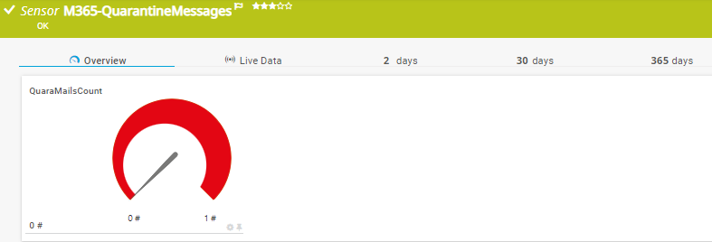
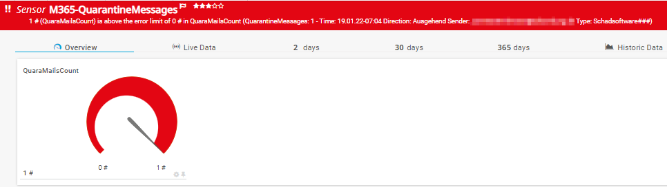

<!-- ABOUT THE PROJECT -->
### About The Project
Project Owner: Jannos-443

PRTG Powershell Script to monitor Microsoft 365 QuarantineMessages

I use this Script to safe me the daily check for false positives

Free and open source: [MIT License](https://github.com/Jannos-443/PRTG-M365/blob/main/LICENSE)

**Features**
* Monitor QuarantineMessages

## HOW TO

1. Create Azure AD Application and Assign Exchange.ManageAsApp Permission
- Add Application to Global Readers Azure AD Role
- Guide: [Microsoft Exchange App Only Auth Powershell]https://docs.microsoft.com/en-us/powershell/exchange/app-only-auth-powershell-v2?view=exchange-ps#set-up-app-only-authentication

2. Place `PRTG-M365-QuarantineMessages.ps1` under `C:\Program Files (x86)\PRTG Network Monitor\Custom Sensors\EXEXML`

3. Place your Self-Signed Certificate on the PRTG Server(s) or Import it into Cert Store
- Placed in file Structure = -CertificateFilePath 'C:\YourPathToCert\Cert.pfx' -CertificatePassword 'YourSelfSignedCertPassword'
- Imported into Cert Store = -CertificateThumbPrint 'YourSelfSignedCertThumbPrint'


## Usage

```powershell
-CertificateFilePath 'C:\YourPathToCert\Cert.pfx' -CertificatePassword 'YourSelfSignedCertPassword' -ApplicationID 'xxxxxxxx-xxxx-xxxx-xxxx-xxxxxxxxxxxx' -TenatDomainName 'contoso.onmicrosoft.com'
```
Using Self Signed Certificate in placed on PRTG Server(s)

```powershell
-CertificateThumbPrint 'YourSelfSignedCertThumbPrint' -ApplicationID 'xxxxxxxx-xxxx-xxxx-xxxx-xxxxxxxxxxxx' -TenatDomainName 'contoso.onmicrosoft.com'
```
Using Self Signed Certificate imported in Cert Store


Example Output:





